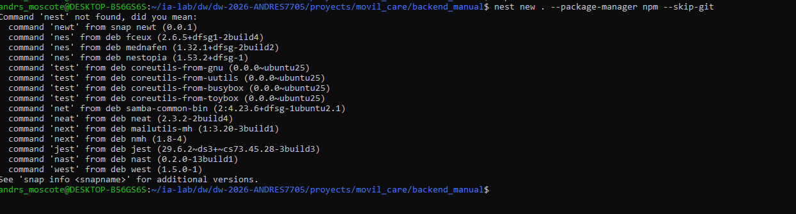
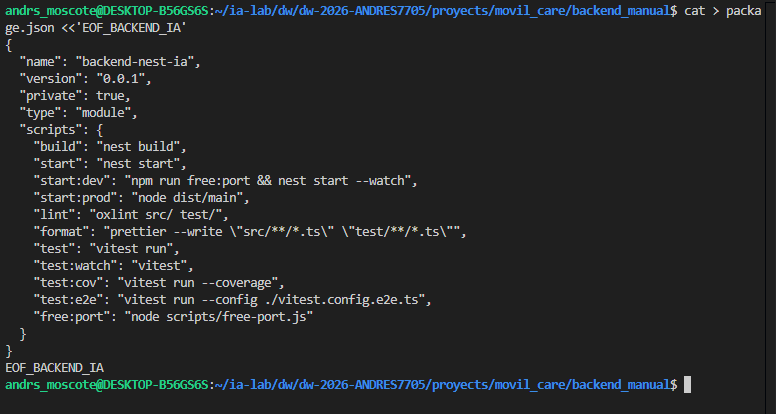

## 2. Requisitos previos

- **Node.js ≥ 20** y **npm ≥ 10**: `node -v` y `npm -v`.
- **Nest CLI** instalado globalmente (lo usa `nest new`):

```bash
npm install -g @nestjs/cli
```

- Una base de datos accesible (en el laboratorio se usa **MySQL**, pero soporta `mysql | postgres | mssql | oracle`).
- Terminal con `bash` (para los heredocs).

```bash
node -v && npm -v && nest --version
```
<p align="center">
  
</p>


### 3.2 Crear el proyecto con `nest new`

```bash
nest new . --package-manager npm --skip-git
```
<p align="center">
  
</p>

### 3.3 Convertir a ESM y definir los scripts

> ⚙️ `transversal` — `package.json` (raíz del proyecto).

```bash
cat > package.json <<'EOF_BACKEND_IA'
{
  "name": "backend-nest-ia",
  "version": "0.0.1",
  "private": true,
  "type": "module",
  "scripts": {
    "build": "nest build",
    "start": "nest start",
    "start:dev": "npm run free:port && nest start --watch",
    "start:prod": "node dist/main",
    "lint": "oxlint src/ test/",
    "format": "prettier --write \"src/**/*.ts\" \"test/**/*.ts\"",
    "test": "vitest run",
    "test:watch": "vitest",
    "test:cov": "vitest run --coverage",
    "test:e2e": "vitest run --config ./vitest.config.e2e.ts",
    "free:port": "node scripts/free-port.js"
  }
}
EOF_BACKEND_IA
```
<p align="center">
  
</p>

### 3.4 Instalar dependencias adicionales

> `nest new` ya instaló las **base**. Instala las **adicionales** de este proyecto:

```bash
npm install @nestjs/swagger \
  sequelize sequelize-typescript mysql2 pg oracledb tedious \
  class-validator class-transformer dotenv
```

| Paquete | Función |
|---|---|
| `@nestjs/swagger` | documentación OpenAPI/Swagger desde decoradores. |
| `sequelize` + `sequelize-typescript` | ORM; el segundo añade decoradores `@Table`/`@Column`. |
| `mysql2` / `pg` / `oracledb` / `tedious` | drivers de BD para **elegir el motor** con una variable de entorno. |
| `class-validator` | validación declarativa (`@IsString`, `@IsEmail`, …). |
| `class-transformer` | convierte objetos planos a instancias (`plainToInstance`, `@Type`). |
| `dotenv` | carga `.env` en `process.env`. |

```bash
npm install -D @types/supertest \
  vitest @vitest/coverage-v8 vite-tsconfig-paths supertest \
  oxlint source-map-support
```

| Paquete | Función |
|---|---|
| `@types/supertest` | tipos para Supertest. |
| `vitest` + `@vitest/coverage-v8` | framework de pruebas y cobertura. |
| `vite-tsconfig-paths` | resuelve alias de `tsconfig` en Vitest. |
| `supertest` | cliente HTTP para pruebas e2e. |
| `oxlint` | linter rápido. |
| `source-map-support` | stack traces en producción. |

<p align="center">
  
</p>

### 3.5 Configurar TypeScript y tooling

> ⚙️ `transversal` — archivos de configuración.

```bash
cat > tsconfig.json <<'EOF_BACKEND_IA'
{
  "compilerOptions": {
    "module": "nodenext",
    "moduleResolution": "nodenext",
    "resolvePackageJsonExports": true,
    "esModuleInterop": true,
    "isolatedModules": true,
    "declaration": true,
    "removeComments": true,
    "emitDecoratorMetadata": true,
    "experimentalDecorators": true,
    "allowSyntheticDefaultImports": true,
    "target": "ES2023",
    "sourceMap": true,
    "outDir": "./dist",
    "incremental": true,
    "skipLibCheck": true,
    "strict": true,
    "strictPropertyInitialization": false,
    "types": ["vitest/globals", "node"]
  }
}
EOF_BACKEND_IA
```

- `module`/`moduleResolution: "nodenext"` → ESM. `emitDecoratorMetadata` + `experimentalDecorators` → decoradores de Nest.

```bash
cat > tsconfig.build.json <<'EOF_BACKEND_IA'
{
  "extends": "./tsconfig.json",
  "compilerOptions": { "rootDir": "./src" },
  "include": ["src"],
  "exclude": ["node_modules", "test", "dist", "**/*spec.ts"]
}
EOF_BACKEND_IA
```

```bash
cat > nest-cli.json <<'EOF_BACKEND_IA'
{
  "$schema": "https://json.schemastore.org/nest-cli",
  "collection": "@nestjs/schematics",
  "sourceRoot": "src",
  "compilerOptions": { "deleteOutDir": true }
}
EOF_BACKEND_IA
```

```bash
cat > .prettierrc <<'EOF_BACKEND_IA'
{
  "singleQuote": true,
  "trailingComma": "all"
}
EOF_BACKEND_IA
```

```bash
cat > oxlint.json <<'EOF_BACKEND_IA'
{
  "$schema": "https://raw.githubusercontent.com/oxc-project/oxc/main/crates/oxc_linter/src/rules.rs",
  "rules": {
    "@typescript-eslint/no-explicit-any": "off",
    "@typescript-eslint/no-floating-promises": "warn"
  },
  "env": { "node": true }
}
EOF_BACKEND_IA
```

```bash
cat > .gitignore <<'EOF_BACKEND_IA'
# dependencias y build
node_modules/
dist/

# entorno local
.env
.env.local
.env.*.local

# logs
*.log
npm-debug.log*
*.tsbuildinfo
EOF_BACKEND_IA
```

