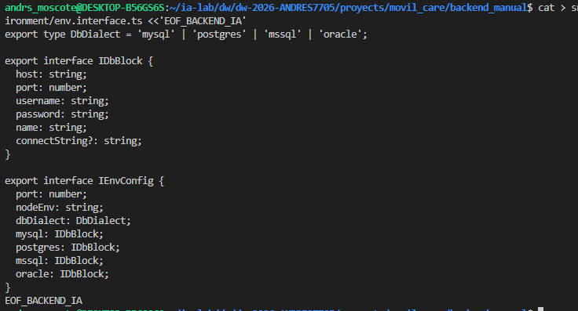
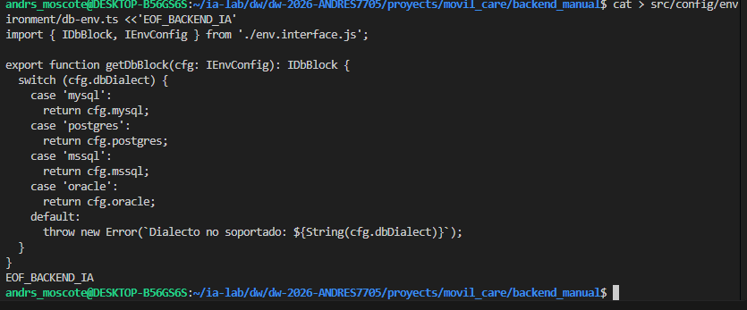

## 2. Requisitos previos

- **Node.js ≥ 20** y **npm ≥ 10**: `node -v` y `npm -v`.
- **Nest CLI** instalado globalmente (lo usa `nest new`):

```bash
npm install -g @nestjs/cli
```

- Una base de datos accesible (en el laboratorio se usa **MySQL**, pero soporta `mysql | postgres | mssql | oracle`).
- Terminal con `bash` (para los heredocs).

```bash
node -v && npm -v && nest --version
```
<p align="center">
  
</p>


### 3.2 Crear el proyecto con `nest new`

```bash
nest new . --package-manager npm --skip-git
```
<p align="center">
  
</p>

### 3.3 Convertir a ESM y definir los scripts

> ⚙️ `transversal` — `package.json` (raíz del proyecto).

```bash
cat > package.json <<'EOF_BACKEND_IA'
{
  "name": "backend-nest-ia",
  "version": "0.0.1",
  "private": true,
  "type": "module",
  "scripts": {
    "build": "nest build",
    "start": "nest start",
    "start:dev": "npm run free:port && nest start --watch",
    "start:prod": "node dist/main",
    "lint": "oxlint src/ test/",
    "format": "prettier --write \"src/**/*.ts\" \"test/**/*.ts\"",
    "test": "vitest run",
    "test:watch": "vitest",
    "test:cov": "vitest run --coverage",
    "test:e2e": "vitest run --config ./vitest.config.e2e.ts",
    "free:port": "node scripts/free-port.js"
  }
}
EOF_BACKEND_IA
```
<p align="center">
  
</p>

### 3.4 Instalar dependencias adicionales

> `nest new` ya instaló las **base**. Instala las **adicionales** de este proyecto:

```bash
npm install @nestjs/swagger \
  sequelize sequelize-typescript mysql2 pg oracledb tedious \
  class-validator class-transformer dotenv
```

| Paquete | Función |
|---|---|
| `@nestjs/swagger` | documentación OpenAPI/Swagger desde decoradores. |
| `sequelize` + `sequelize-typescript` | ORM; el segundo añade decoradores `@Table`/`@Column`. |
| `mysql2` / `pg` / `oracledb` / `tedious` | drivers de BD para **elegir el motor** con una variable de entorno. |
| `class-validator` | validación declarativa (`@IsString`, `@IsEmail`, …). |
| `class-transformer` | convierte objetos planos a instancias (`plainToInstance`, `@Type`). |
| `dotenv` | carga `.env` en `process.env`. |

```bash
npm install -D @types/supertest \
  vitest @vitest/coverage-v8 vite-tsconfig-paths supertest \
  oxlint source-map-support
```

| Paquete | Función |
|---|---|
| `@types/supertest` | tipos para Supertest. |
| `vitest` + `@vitest/coverage-v8` | framework de pruebas y cobertura. |
| `vite-tsconfig-paths` | resuelve alias de `tsconfig` en Vitest. |
| `supertest` | cliente HTTP para pruebas e2e. |
| `oxlint` | linter rápido. |
| `source-map-support` | stack traces en producción. |

<p align="center">
  
</p>

### 3.5 Configurar TypeScript y tooling

> ⚙️ `transversal` — archivos de configuración.

```bash
cat > tsconfig.json <<'EOF_BACKEND_IA'
{
  "compilerOptions": {
    "module": "nodenext",
    "moduleResolution": "nodenext",
    "resolvePackageJsonExports": true,
    "esModuleInterop": true,
    "isolatedModules": true,
    "declaration": true,
    "removeComments": true,
    "emitDecoratorMetadata": true,
    "experimentalDecorators": true,
    "allowSyntheticDefaultImports": true,
    "target": "ES2023",
    "sourceMap": true,
    "outDir": "./dist",
    "incremental": true,
    "skipLibCheck": true,
    "strict": true,
    "strictPropertyInitialization": false,
    "types": ["vitest/globals", "node"]
  }
}
EOF_BACKEND_IA
```

- `module`/`moduleResolution: "nodenext"` → ESM. `emitDecoratorMetadata` + `experimentalDecorators` → decoradores de Nest.

```bash
cat > tsconfig.build.json <<'EOF_BACKEND_IA'
{
  "extends": "./tsconfig.json",
  "compilerOptions": { "rootDir": "./src" },
  "include": ["src"],
  "exclude": ["node_modules", "test", "dist", "**/*spec.ts"]
}
EOF_BACKEND_IA
```

```bash
cat > nest-cli.json <<'EOF_BACKEND_IA'
{
  "$schema": "https://json.schemastore.org/nest-cli",
  "collection": "@nestjs/schematics",
  "sourceRoot": "src",
  "compilerOptions": { "deleteOutDir": true }
}
EOF_BACKEND_IA
```

```bash
cat > .prettierrc <<'EOF_BACKEND_IA'
{
  "singleQuote": true,
  "trailingComma": "all"
}
EOF_BACKEND_IA
```

```bash
cat > oxlint.json <<'EOF_BACKEND_IA'
{
  "$schema": "https://raw.githubusercontent.com/oxc-project/oxc/main/crates/oxc_linter/src/rules.rs",
  "rules": {
    "@typescript-eslint/no-explicit-any": "off",
    "@typescript-eslint/no-floating-promises": "warn"
  },
  "env": { "node": true }
}
EOF_BACKEND_IA
```

```bash
cat > .gitignore <<'EOF_BACKEND_IA'
# dependencias y build
node_modules/
dist/

# entorno local
.env
.env.local
.env.*.local

# logs
*.log
npm-debug.log*
*.tsbuildinfo
EOF_BACKEND_IA
```
<p align="center">
  
</p>

 ## 3.6 Script auxiliar y variables de entorno

```bash
mkdir -p scripts
cat > scripts/free-port.js <<'EOF_BACKEND_IA'
import { execSync } from 'node:child_process';

const port = process.env.PORT ?? 3002;
const label = `[free-port]`;

function findAndKill(p) {
  const commands = [`lsof -ti tcp:${p}`, `fuser ${p}/tcp 2>/dev/null`];
  for (const cmd of commands) {
    try {
      const out = execSync(cmd, { encoding: 'utf8' }).trim();
      if (!out) continue;
      for (const pid of out.split(/\s+/).filter(Boolean)) {
        try {
          execSync(`kill -9 ${pid}`, { stdio: 'ignore' });
          console.log(`${label} liberado: mató PID ${pid} en el puerto ${p}`);
        } catch { /* ya no existe */ }
      }
      return;
    } catch { /* comando no disponible o puerto libre */ }
  }
  console.log(`${label} puerto ${p} libre`);
}

findAndKill(port);
EOF_BACKEND_IA
```

```bash
cat > .env.example <<'EOF_BACKEND_IA'
PORT=3002
NODE_ENV=development
DB_DIALECT=mysql
DB_MYSQL_HOST=<IP_HOST_DOCKER>
DB_MYSQL_PORT=3306
DB_MYSQL_USERNAME=admin
DB_MYSQL_PASSWORD=<PASSWORD>
DB_MYSQL_NAME=tecnogua_ia
EOF_BACKEND_IA
```


```bash
cp .env.example .env
```

<p align="center">
  
</p>

### 3.7 Estructura de carpetas

```bash
mkdir -p src/common/exceptions src/common/filters src/common/interceptors
mkdir -p src/config/environment
mkdir -p src/infrastructure/database/sequelize src/infrastructure/database/seeders
mkdir -p src/health
mkdir -p src/features/business
for f in clients product-types products sales; do
  mkdir -p "src/features/business/$f/domain/entities" \
           "src/features/business/$f/domain/interfaces" \
           "src/features/business/$f/domain/exceptions" \
           "src/features/business/$f/application/dto" \
           "src/features/business/$f/application/mappers" \
           "src/features/business/$f/application/use-cases" \
           "src/features/business/$f/infrastructure/persistence/models" \
           "src/features/business/$f/infrastructure/persistence/repositories" \
           "src/features/business/$f/infrastructure/persistence/seeders" \
           "src/features/business/$f/presentation/http/controllers"
done
```

> ✅ **Fin de ISS-01**: el proyecto arranca (aún sin features). El resto de capas se crean en los siguientes segmentos.

<p align="center">
  
</p>

## 4. ISS-02 · Entorno Sequelize y common

> **Segmento:** configuración validada, manejo uniforme de errores, interceptores y conexión a BD (todo transversal).

### 4.1 Capa de configuración `config/environment`

> ⚙️ `transversal` — carga, valida y tipa las variables de entorno.


**4.1.1 Tipos (`env.interface.ts`):**

```bash
cat > src/config/environment/env.interface.ts <<'EOF_BACKEND_IA'
export type DbDialect = 'mysql' | 'postgres' | 'mssql' | 'oracle';

export interface IDbBlock {
  host: string;
  port: number;
  username: string;
  password: string;
  name: string;
  connectString?: string;
}

export interface IEnvConfig {
  port: number;
  nodeEnv: string;
  dbDialect: DbDialect;
  mysql: IDbBlock;
  postgres: IDbBlock;
  mssql: IDbBlock;
  oracle: IDbBlock;
}
EOF_BACKEND_IA
```


<p align="center">
  
</p>

**4.1.2 Validación (`env.validation.ts`):**

```bash
cat > src/config/environment/env.validation.ts <<'EOF_BACKEND_IA'
import { plainToInstance } from 'class-transformer';
import { IsIn, IsNotEmpty, validateSync, ValidateIf } from 'class-validator';

const DIALECTS = ['mysql', 'postgres', 'mssql', 'oracle'];

export class EnvVariables {
  @IsIn(DIALECTS, {
    message: 'DB_DIALECT debe ser mysql | postgres | mssql | oracle',
  })
  DB_DIALECT!: string;

  // MySQL
  @ValidateIf((o) => o.DB_DIALECT === 'mysql')
  @IsNotEmpty({ message: 'DB_MYSQL_HOST es requerida (DB_DIALECT=mysql)' })
  DB_MYSQL_HOST?: string;
  @ValidateIf((o) => o.DB_DIALECT === 'mysql')
  @IsNotEmpty({ message: 'DB_MYSQL_USERNAME es requerida (DB_DIALECT=mysql)' })
  DB_MYSQL_USERNAME?: string;
  @ValidateIf((o) => o.DB_DIALECT === 'mysql')
  @IsNotEmpty({ message: 'DB_MYSQL_NAME es requerida (DB_DIALECT=mysql)' })
  DB_MYSQL_NAME?: string;

  // PostgreSQL
  @ValidateIf((o) => o.DB_DIALECT === 'postgres')
  @IsNotEmpty({ message: 'DB_POSTGRES_HOST es requerida (DB_DIALECT=postgres)' })
  DB_POSTGRES_HOST?: string;
  @ValidateIf((o) => o.DB_DIALECT === 'postgres')
  @IsNotEmpty({ message: 'DB_POSTGRES_USERNAME es requerida (DB_DIALECT=postgres)' })
  DB_POSTGRES_USERNAME?: string;
  @ValidateIf((o) => o.DB_DIALECT === 'postgres')
  @IsNotEmpty({ message: 'DB_POSTGRES_NAME es requerida (DB_DIALECT=postgres)' })
  DB_POSTGRES_NAME?: string;

  // MSSQL
  @ValidateIf((o) => o.DB_DIALECT === 'mssql')
  @IsNotEmpty({ message: 'DB_MSSQL_HOST es requerida (DB_DIALECT=mssql)' })
  DB_MSSQL_HOST?: string;
  @ValidateIf((o) => o.DB_DIALECT === 'mssql')
  @IsNotEmpty({ message: 'DB_MSSQL_USERNAME es requerida (DB_DIALECT=mssql)' })
  DB_MSSQL_USERNAME?: string;
  @ValidateIf((o) => o.DB_DIALECT === 'mssql')
  @IsNotEmpty({ message: 'DB_MSSQL_NAME es requerida (DB_DIALECT=mssql)' })
  DB_MSSQL_NAME?: string;

  // Oracle
  @ValidateIf((o) => o.DB_DIALECT === 'oracle')
  @IsNotEmpty({ message: 'DB_ORACLE_HOST es requerida (DB_DIALECT=oracle)' })
  DB_ORACLE_HOST?: string;
  @ValidateIf((o) => o.DB_DIALECT === 'oracle')
  @IsNotEmpty({ message: 'DB_ORACLE_USERNAME es requerida (DB_DIALECT=oracle)' })
  DB_ORACLE_USERNAME?: string;
  @ValidateIf((o) => o.DB_DIALECT === 'oracle')
  @IsNotEmpty({ message: 'DB_ORACLE_NAME es requerida (DB_DIALECT=oracle)' })
  DB_ORACLE_NAME?: string;
}

export function validateEnv(raw: Record<string, unknown>): EnvVariables {
  const config = plainToInstance(EnvVariables, raw);
  const errors = validateSync(config, { whitelist: false, forbidNonWhitelisted: false });
  if (errors.length > 0) {
    const messages = errors
      .map((e) => Object.values(e.constraints ?? {}).join('; '))
      .join(' | ');
    throw new Error(`Error de configuración: ${messages}`);
  }
  return config;
}
EOF_BACKEND_IA
```

<p align="center">
  
</p>


**4.1.3 Selector de BD (`db-env.ts`):**

```bash
cat > src/config/environment/db-env.ts <<'EOF_BACKEND_IA'
import { IDbBlock, IEnvConfig } from './env.interface.js';

export function getDbBlock(cfg: IEnvConfig): IDbBlock {
  switch (cfg.dbDialect) {
    case 'mysql':
      return cfg.mysql;
    case 'postgres':
      return cfg.postgres;
    case 'mssql':
      return cfg.mssql;
    case 'oracle':
      return cfg.oracle;
    default:
      throw new Error(`Dialecto no soportado: ${String(cfg.dbDialect)}`);
  }
}
EOF_BACKEND_IA
```

<p align="center">
  
</p>

**4.1.4 Carga (`env.config.ts`):**

```bash
cat > src/config/environment/env.config.ts <<'EOF_BACKEND_IA'
import { config as loadDotenv } from 'dotenv';
import { IDbBlock, IEnvConfig, DbDialect } from './env.interface.js';
import { validateEnv } from './env.validation.js';

export const ENV_CONFIG = Symbol('ENV_CONFIG');

function toBlock(prefix: string, raw: Record<string, unknown>, defaultPort: number): IDbBlock {
  return {
    host: String(raw[`DB_${prefix}_HOST`] ?? 'localhost'),
    port: Number(raw[`DB_${prefix}_PORT`] ?? defaultPort),
    username: String(raw[`DB_${prefix}_USERNAME`] ?? ''),
    password: String(raw[`DB_${prefix}_PASSWORD`] ?? ''),
    name: String(raw[`DB_${prefix}_NAME`] ?? ''),
    connectString: raw[`DB_${prefix}_CONNECT_STRING`]
      ? String(raw[`DB_${prefix}_CONNECT_STRING`])
      : undefined,
  };
}

export function loadEnvConfig(): IEnvConfig {
  loadDotenv();
  const raw = process.env as Record<string, unknown>;
  validateEnv(raw);
  const dialect = String(raw.DB_DIALECT) as DbDialect;
  return {
    port: Number(raw.PORT ?? 3002),
    nodeEnv: String(raw.NODE_ENV ?? 'development'),
    dbDialect: dialect,
    mysql: toBlock('MYSQL', raw, 3306),
    postgres: toBlock('POSTGRES', raw, 5432),
    mssql: toBlock('MSSQL', raw, 1433),
    oracle: toBlock('ORACLE', raw, 1521),
  };
}

export const envConfig = {
  KEY: ENV_CONFIG,
};
EOF_BACKEND_IA
```
<p align="center">
  
</p>