# Bitacora Backend Express

## Fase I - Tablas de Negocio 

## 1. ISS-00 — Requisitos previos

**Objetivo:** entorno listo para el laboratorio.  
**Bloqueado por:** ninguno.

### Criterios de aceptación (ISS-00)

- [X] `node -v` muestra v20+ (lab: v24.x)
- [X] `npm -v` responde
- [X] Motor de BD accesible (MySQL recomendado para el primer `sync`)

### Pasos

```bash
node -v
npm -v
```

### Verificación del ISS

```bash
node -v && npm -v
```

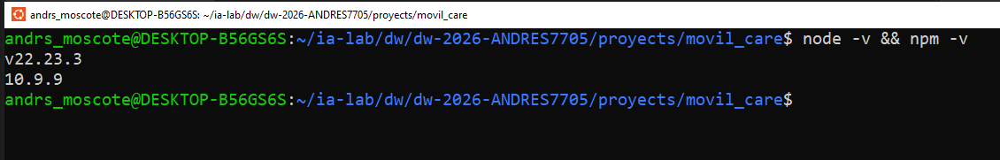

---

# 2. ISS-01 — Esqueleto del proyecto

**Objetivo:** proyecto npm + TypeScript + Express con estructura `features/` y servidor HTTP base.  
**Bloqueado por:** ISS-00.

### Criterios de aceptación (ISS-01) — consolidados

- [X] **2.1** Existe `package.json` con `"type": "commonjs"` y scripts `build` / `dev`
- [X] **2.2** Árbol `src/` con `config`, `database/seeders`, `routes`, `features/business/client` (auth **fuera de alcance** de este lab)
- [X] **2.3** Dependencias Express/TS instaladas (`npm ls --depth=0`)
- [X] **2.4** Existe `tsconfig.json` (`rootDir: ./src`, `outDir: ./dist`, `strict: true`)
- [X] **2.5** Existen `src/server.ts` y `src/config/index.ts` (esqueleto App)
- [X] `npx tsc --noEmit` sin errores al cerrar el ISS

---

## 2.1 Inicializar npm y scripts

**Criterios de este sub-ítem**

- [ ] `package.json` creado
- [ ] Scripts `build` y `dev` definidos

```bash
mkdir app-movilcare-express
cd app-movilcare-express
npm init -y
mkdir -p docs
```

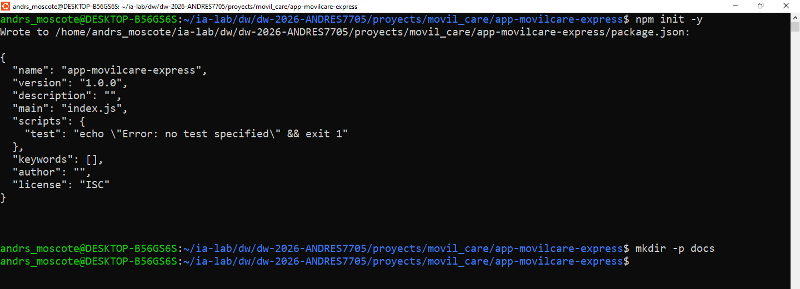

**PARCHE** — `package.json` **ya existe** (lo creó `npm init -y`).

- **Dentro de** `"scripts"`: deja solo (o añade) `build` y `dev` como abajo.
- **Debajo de** `"license"` (o al mismo nivel que `"scripts"`): asegúrate de `"type": "commonjs"`.

Estado esperado de esas claves:

```json
{
  "scripts": {
    "build": "tsc",
    "dev": "nodemon --watch src --ext ts --exec ts-node -- src/server.ts"
  },
  "type": "commonjs"
}
```

```bash
node -e "const p=require('./package.json'); console.log(p.scripts)"
```

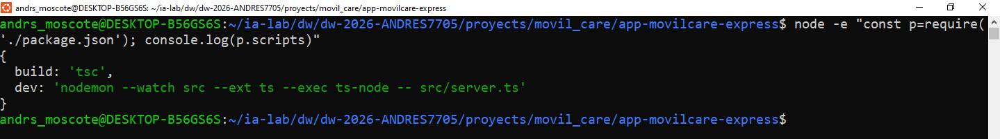

---

## 2.2 Estructura de carpetas (features)

**Criterios de este sub-ítem**

- [ ] Carpetas de infra y features creadas según el árbol

```bash
mkdir -p \
  src/config \
  src/database/seeders \
  src/routes \
  src/features/business
```

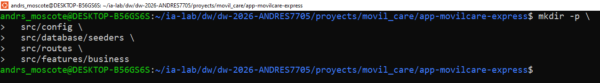

```text
src/
├── config/
├── database/
│   └── seeders/          # solo carpeta (ISS-02 §3.3); runner en ISS-04
├── routes/
├── features/
│   └── business/s       # más features en ISS-06…08
└── server.ts             # §2.5
```

| Carpeta | Uso |
|---------|-----|
| `features/business/<entidad>/` | model + controller + routes (+ seeder, swagger, http, associations) |
| `database/seeders/` | counts + SeedersRunner (`npm run db:seed`) |
| `routes/index.ts` | Agregador de features |
| `config/` · `database/` | Arranque e infraestructura |

**Seeders (patrón del lab)**

| Pieza | Dónde |
|-------|-------|
| Por entidad | `src/features/business/<entidad>/<entidad>.seeder.ts` |
| Runner + counts | `src/database/seeders/{index,counts}.ts` → `npm run db:seed` |
| Datos falsos | `@faker-js/faker` |

```bash
find src -type d | sort
```

---

## 2.3 Dependencias base (Express + TypeScript)

**Criterios de este sub-ítem**

- [ ] `express`, `cors`, `dotenv`, `morgan` instalados
- [ ] `typescript`, `ts-node`, `nodemon`, `@types/*` instalados

```bash
npm install express@^5.2.1 cors@^2.8.6 dotenv@^17.4.2 morgan@^1.12.1

npm install -D typescript@~5.9.2 ts-node@^10.9.2 nodemon@^3.1.14 \
  @types/node@^22.20.3 @types/express@^5.0.6 \
  @types/cors@^2.8.19 @types/morgan@^1.9.10
```

> TypeScript en **5.9.x** por compatibilidad con `ts-node`.

```bash
npm ls --depth=0
```

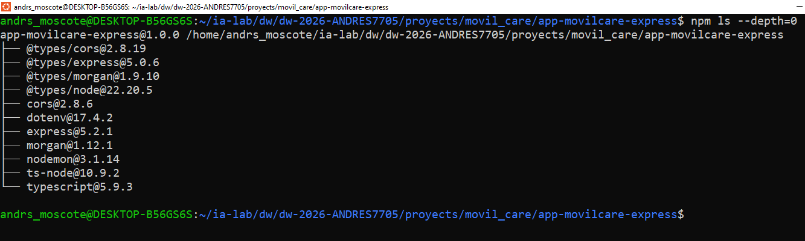

---

## 2.4 TypeScript (`tsconfig.json`)

**Criterios de este sub-ítem**

- [ ] `tsconfig.json` con `rootDir: ./src`, `outDir: ./dist`, `strict: true`

```bash
: > tsconfig.json
cat >> tsconfig.json << 'EOF'
{
  "compilerOptions": {
    "rootDir": "./src",
    "outDir": "./dist",
    "module": "commonjs",
    "target": "ES2020",
    "lib": ["ES2020"],
    "types": ["node"],
    "esModuleInterop": true,
    "resolveJsonModule": true,
    "sourceMap": true,
    "strict": true,
    "skipLibCheck": true,
    "moduleDetection": "force",
    "isolatedModules": true,
    "forceConsistentCasingInFileNames": true
  },
  "include": ["src/**/*"],
  "exclude": ["node_modules", "dist"]
}
EOF
```

```bash
test -f tsconfig.json && npx tsc --showConfig | head -20
```

---

## 2.5 Servidor y App (esqueleto HTTP)

**Criterios de este sub-ítem**

- [ ] Existen `src/server.ts` y `src/config/index.ts`
- [ ] `App` define `settings`, `middlewares`, `routes`, `dbConnection`, `listen` (placeholders OK)

### 2.5.1 `src/server.ts`

```bash
: > src/server.ts
cat >> src/server.ts << 'EOF'
import { App } from './config/index';

async function main() {
    const app = new App();
    await app.listen();
}

main();
EOF
```

### 2.5.2 `src/config/index.ts` (esqueleto)

> En ISS-01 el App es **esqueleto**. Los imports de modelos, associations, Routes,
> Swagger y el `sync` completo se añaden con **PARCHE** en ISS-02…08.
> El archivo **final** consolidado aparece al cierre de ISS-08.

```bash
: > src/config/index.ts
cat >> src/config/index.ts << 'EOF'
import dotenv from "dotenv";
import express, { Application } from "express";
import morgan from "morgan";
var cors = require("cors");

dotenv.config();

export class App {
  public app: Application;

  constructor(private port?: number | string) {
    this.app = express();
    this.settings();
    this.middlewares();
    this.routes();
    this.dbConnection();
  }

  private settings(): void {
    this.app.set('port', this.port || process.env.PORT || 4000);
  }

  private middlewares(): void {
    this.app.use(morgan('dev'));
    this.app.use(cors());
    this.app.use(express.json());
    this.app.use(express.urlencoded({ extended: false }));
  }

  private routes(): void {
    // ISS-03 §4.3
  }

  private async dbConnection(): Promise<void> {
    // ISS-02 / ISS-03
  }

  async listen() {
    await this.app.listen(this.app.get('port'));
    console.log(`🚀 Servidor ejecutándose en puerto ${this.app.get('port')}`);
  }
}
EOF
```

### Verificación del ISS-01

```bash
npx tsc --noEmit
find src -type f | sort
```

### Cierre del ISS

```bash
npm run dev
```

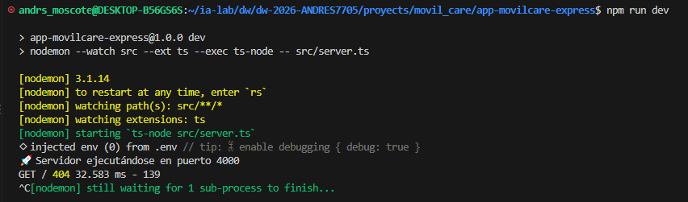

> El servidor debe arrancar sin error. Detenerlo con Ctrl+C antes de continuar.

# 3. ISS-02 — Sequelize y conexión a MySQL

**Objetivo:** conexión reutilizable y configuración fuera del código. **Bloqueado por:** ISS-01.

### Criterios de aceptación

- [ ] Sequelize y `mysql2` instalados.
- [ ] `.env` contiene conexión para MySQL y está excluido de Git.
- [ ] `src/databases/db.ts` exporta `sequelize` y `testConnection`.
- [ ] La aplicación prueba la conexión antes de sincronizar modelos.

## 3.1 Dependencias y entorno

```bash
npm install sequelize@^6 mysql2
```

Añade `.env`:

```dotenv
PORT=4000
DB_ENGINE=mysql
MYSQL_HOST=172.23.120.29
MYSQL_PORT=3307
MYSQL_USER=root
MYSQL_PASSWORD=andres123453
MYSQL_NAME=movil_care
NODE_ENV=development
```

Asegúrate de que `.env` esté incluido en `.gitignore`. Usa `.env.example` para compartir solo claves y valores de muestra.

## 3.2 Crear `src/databases/db.ts`

```bash
: > src/databases/db.ts
cat >> src/databases/db.ts << 'EOF'
import { Sequelize } from "sequelize";
import dotenv from "dotenv";

dotenv.config();

export const sequelize = new Sequelize(
  process.env.MYSQL_NAME || "movilcare_dev",
  process.env.MYSQL_USER || "root",
  process.env.MYSQL_PASSWORD || "",
  {
    host: process.env.MYSQL_HOST || "127.0.0.1",
    port: Number(process.env.MYSQL_PORT) || 3306,
    dialect: "mysql",
    logging: process.env.NODE_ENV === "development" ? console.log : false,
    define: { underscored: true, timestamps: true },
  }
);

export async function testConnection(): Promise<void> {
  await sequelize.authenticate();
  console.log("MySQL connection established");
}
EOF
```

**PARCHE** — importa `sequelize` y `testConnection` en `src/configs/index.ts`, e implementa una inicialización asíncrona antes de abrir el puerto. Desde ISS-03 se registrarán los modelos y asociaciones antes de `sequelize.sync({ alter: true })`.

**Verificación y cierre:** `npx tsc --noEmit`; con MySQL activo, `npm run dev` debe conectar sin crear aún tablas de negocio.

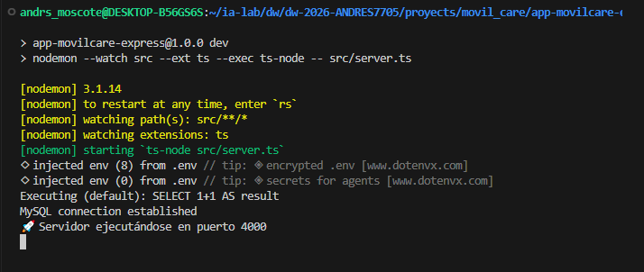

---

# 4. ISS-03 — Features base

**Objetivo:** crear las entidades independientes `products`, `customers`, `employees` y `spare_parts`, cada una con modelo, controller, rutas CRUD y pruebas HTTP. **Bloqueado por:** ISS-02.

### Criterios de aceptación

- [ ] Están creadas las cuatro carpetas inglesas plurales indicadas.
- [ ] Cada modelo declara explícitamente `tableName`, `timestamps: true` y `underscored: true`.
- [ ] GET all, GET by id, POST, PUT, PATCH y DELETE responden con códigos HTTP adecuados.
- [ ] Las rutas base son `/api/products`, `/api/customers`, `/api/employees` y `/api/spare-parts`.
- [ ] Los modelos quedan registrados antes del `sync`.

## 4.1 Carpetas y archivos por feature

```bash
for feature in products customers employees spare-parts; do
  mkdir -p "src/features/businesses/$feature/requests"
done
```

En cada feature crea `<feature>.model.ts`, `<feature>.controller.ts` y `<feature>.routes.ts`. El patrón de modelo siguiente es ilustrativo; declara en cada `init` todas las columnas de la tabla correspondiente, según la matriz ISS-03. No copies atributos que no pertenezcan a esa entidad.

## 4.2 Patrón de modelo Sequelize

```ts
import { DataTypes, Model } from "sequelize";
import { sequelize } from "../../../databases/db";

export class Product extends Model {
  declare id: number;
  declare sku: string;
  declare name: string;
  declare price: number;
  declare isActive: boolean;
}

Product.init(
  {
    id: { type: DataTypes.BIGINT, autoIncrement: true, primaryKey: true },
    sku: { type: DataTypes.STRING(40), allowNull: false, unique: true },
    name: { type: DataTypes.STRING(150), allowNull: false },
    price: { type: DataTypes.DECIMAL(12, 2), allowNull: false },
    isActive: { type: DataTypes.BOOLEAN, allowNull: false, defaultValue: true },
  },
  {
    sequelize,
    modelName: "Product",
    tableName: "products",
    timestamps: true,
    underscored: true,
  }
);
```

`DECIMAL` puede llegar como string en Sequelize; valida y serializa importes sin asumir que siempre son números JS. Define ENUMs con los valores exactos de la tabla. Usa índices únicos compuestos donde la matriz lo indique.

## 4.3 Matriz de columnas de negocio

Los nombres de esta matriz son atributos de API en inglés `camelCase`; `underscored: true` los almacena como columnas `snake_case`. En cada tabla agrega `id` autoincremental `BIGINT` y timestamps salvo donde se indique otra cosa.

### `products` — `products.model.ts`

| Atributo | Tipo / restricciones |
|---|---|
| `sku` | `STRING(40)`, requerido, único |
| `name` | `STRING(150)`, requerido |
| `description` | `TEXT`, opcional |
| `type` | ENUM `EQUIPMENT`, `ACCESSORY`, requerido |
| `brand`, `model` | `STRING(80)`, opcionales |
| `requiresSerial` | BOOLEAN, default `false` |
| `cost` | `DECIMAL(12,2)`, no negativo |
| `price` | `DECIMAL(12,2)`, requerido, no negativo |
| `taxPercentage` | `DECIMAL(5,2)`, default `0` |
| `defaultWarrantyMonths` | SMALLINT, default `0` |
| `isActive` | BOOLEAN, default `true` |

### `customers` — `customers.model.ts`

| Atributo | Tipo / restricciones |
|---|---|
| `documentType` | ENUM `CC`, `CE`, `NIT`, `PASSPORT`, `TI`, requerido |
| `documentNumber` | `STRING(30)`, requerido; único junto con `documentType` |
| `firstName` | `STRING(100)`, requerido |
| `lastName` | `STRING(100)`, opcional |
| `companyName` | `STRING(150)`, opcional |
| `phone` | `STRING(20)`, opcional |
| `email` | `STRING(120)`, opcional, validar formato; único cuando tenga valor |
| `address` | `STRING(200)`, opcional |
| `isActive` | BOOLEAN, default `true` |

### `employees` — `employees.model.ts`

| Atributo | Tipo / restricciones |
|---|---|
| `name` | `STRING(150)`, requerido |
| `document` | `STRING(30)`, único |
| `role` | ENUM `SELLER`, `TECHNICIAN`, `ADMIN`, requerido |
| `email` | `STRING(120)`, único |
| `isActive` | BOOLEAN, default `true` |

### `spare_parts` — `spare-parts.model.ts`

| Atributo | Tipo / restricciones |
|---|---|
| `sku` | `STRING(40)`, requerido, único |
| `name` | `STRING(150)`, requerido |
| `description` | TEXT, opcional |
| `compatibility` | `STRING(255)`, opcional |
| `cost`, `price` | `DECIMAL(12,2)`, no negativos |
| `currentStock` | INTEGER, requerido, default `0`, no negativo |
| `minimumStock` | INTEGER, default `0` |
| `isActive` | BOOLEAN, default `true` |

## 4.4 CRUD común

Implementa para cada feature la secuencia que sigue el laboratorio de referencia. Controladores deben validar parámetros/body y traducir errores de validación a `400`, registros inexistentes a `404`, altas a `201`, consultas/actualizaciones/borrados correctos a `200` o `204`, y errores inesperados a `500` sin filtrar secretos.

```text
GET     /api/<plural>       listar con paginación; excluir inactivos solo si el endpoint lo documenta
GET     /api/<plural>/:id   obtener una entidad por id
POST    /api/<plural>       crear y devolver la entidad
PUT     /api/<plural>/:id   reemplazo validado de los campos editables
PATCH   /api/<plural>/:id   actualización parcial de campos permitidos
DELETE  /api/<plural>/:id   baja lógica si tiene is_active; no borrar historia transaccional
```

Usa `req.params.id` validado como entero positivo. No hagas `Model.update(req.body)` directamente: selecciona explícitamente las propiedades editables. Nunca permitas actualizar claves primarias, timestamps ni asociaciones no autorizadas por el caso de uso.

## 4.5 Enrutamiento

En cada `<feature>.routes.ts`, registra el endpoint base inglés plural y sus métodos HTTP. En `src/routes/index.ts`, monta cada router con `app.use("/api", router)` o una convención equivalente uniforme. No mezcles endpoints traducidos al español con endpoints ingleses.

**Pruebas HTTP:** crea archivos REST Client en `requests/`, por ejemplo `products.get.http`, `products.create.http`, con `@baseUrl = http://localhost:4000` y JSON que respete las columnas requeridas.

**Verificación y cierre:** `npx tsc --noEmit`; prueba el CRUD de las cuatro entidades, comprueba restricciones de unicidad y ejecuta `npm run dev`.

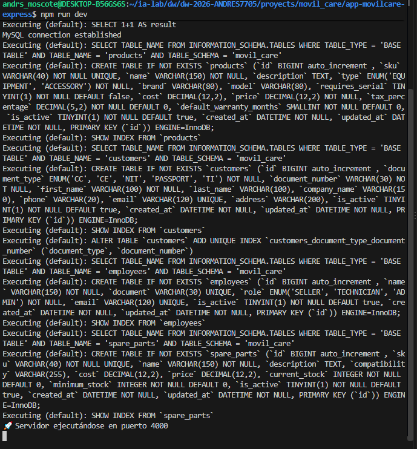

---

# 5. ISS-04 — Serialized units

**Objetivo:** rastrear cada equipo físico mediante serial e identificar su producto. **Bloqueado por:** ISS-03.

### Criterios de aceptación

- [ ] Modelo en `src/features/businesses/serialized-units/` y tabla `serialized_units`.
- [ ] `product_id` referencia `products.id`; `serial` es único y requerido.
- [ ] `secondary_serial` admite NULL y es único cuando tenga valor.
- [ ] Estado limitado a `IN_STOCK`, `SOLD`, `IN_SERVICE`, `RETIRED`.
- [ ] CRUD y asociación `Product.hasMany(SerializedUnit)` / `SerializedUnit.belongsTo(Product)`.

### Columnas

| Atributo | Tipo / restricciones |
|---|---|
| `productId` | BIGINT, FK requerida a `products` |
| `serial` | `STRING(80)`, requerido, único |
| `secondarySerial` | `STRING(80)`, opcional, único si no es NULL |
| `state` | ENUM `IN_STOCK`, `SOLD`, `IN_SERVICE`, `RETIRED`, requerido |
| `receivedAt` | DATE, opcional |
| `isActive` | BOOLEAN, default `true` |

Crear `serialized-units.model.ts`, `serialized-units.controller.ts`, `serialized-units.routes.ts` y requests siguiendo ISS-03. El endpoint CRUD es `/api/serialized-units`; filtrar por `productId` y `state` mediante query params. Proteger cambios de estado: no aceptar cualquier transición desde PATCH; las operaciones de venta y servicio controlarán las transiciones permitidas.

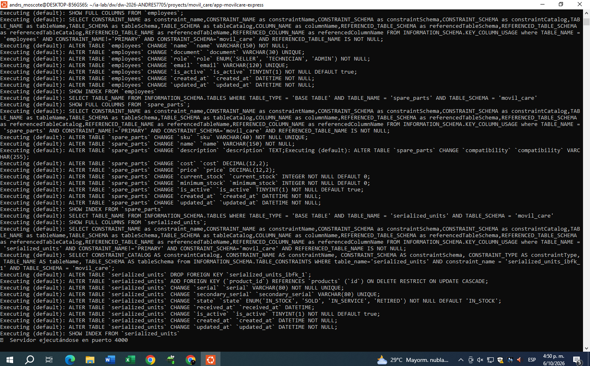

# 6. ISS-06 — Sales y sale details

**Objetivo:** modelar la factura y sus líneas y vincular seriales cuando el producto lo requiera. **Bloqueado por:** ISS-04.

### Criterios de aceptación

- [ ] Tablas `sales` y `sale_details`, features y rutas con nombres ingleses plurales.
- [ ] Venta pertenece a cliente y opcionalmente a empleado vendedor.
- [ ] Detalle pertenece a venta y producto; unidad serializada opcional y única.
- [ ] Estados y totales respetan la matriz y reglas abajo.
- [ ] La confirmación se realiza en transacción y no vende una unidad dos veces.

### `sales`

| Atributo | Tipo / restricciones |
|---|---|
| `number` | `STRING(20)`, requerido, único |
| `customerId` | BIGINT, FK requerida a `customers` |
| `sellerId` | BIGINT, FK opcional a `employees` |
| `soldAt` | DATE, requerido |
| `subtotal`, `taxes`, `total` | `DECIMAL(12,2)`, requeridos |
| `discount` | `DECIMAL(12,2)`, default `0` |
| `state` | ENUM `DRAFT`, `CONFIRMED`, `PAID`, `CANCELLED`, requerido |

Regla: `total = subtotal - discount + taxes`.

### `sale_details`

| Atributo | Tipo / restricciones |
|---|---|
| `saleId` | BIGINT, FK requerida a `sales` |
| `productId` | BIGINT, FK requerida a `products` |
| `serializedUnitId` | BIGINT, FK opcional a `serialized_units`, único si tiene valor |
| `quantity` | INTEGER, requerido, mayor que 0; debe ser 1 si hay serial |
| `unitPrice` | `DECIMAL(12,2)`, requerido |
| `discount` | `DECIMAL(12,2)`, default `0` |
| `taxPercentage` | `DECIMAL(5,2)`, opcional |
| `total` | `DECIMAL(12,2)`, requerido |
| `notes` | `STRING(255)`, opcional |

Asociaciones: `Customer.hasMany(Sale)`, `Employee.hasMany(Sale, { foreignKey: "sellerId" })`, `Sale.hasMany(SaleDetail)`, `Product.hasMany(SaleDetail)` y `SaleDetail.belongsTo(SerializedUnit)`. Usa nombres explícitos de `foreignKey` y alias cuando un modelo participa con más de un rol.

### Flujo de confirmación

Implementa un método de servicio transaccional; no confirmes mediante CRUD genérico:

1. Abrir transacción y leer venta y detalles.
2. Verificar estado `DRAFT`, cliente activo, productos activos y cantidades/totales.
3. Para cada producto con `requiresSerial = true`, exigir exactamente una unidad serializada compatible en estado `IN_STOCK`; exigir `quantity = 1`.
4. Reservar/actualizar la unidad dentro de la transacción y cambiarla a `SOLD` al confirmar.
5. Recalcular subtotal, descuento, impuestos y total desde las líneas; cambiar venta a `CONFIRMED`.
6. Confirmar transacción; ante cualquier fallo, rollback completo.

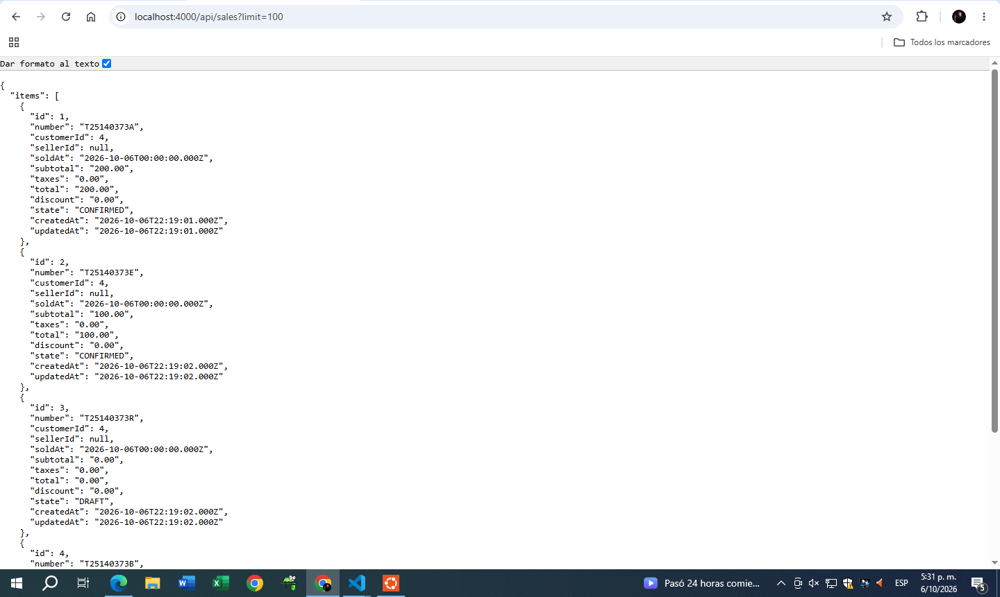

# 7. ISS-06 — Warranties

> El archivo de entrada se llama `iss-07.md`, pero su encabezado y el manual del proyecto identifican esta entrega como **ISS-06 — Warranties**. Se conserva esa secuencia funcional: depende de las ventas (ISS-05); la ISS-07 del manual corresponde a órdenes de servicio.

**Objetivo:** asociar garantías comerciales, extendidas o de proveedor a líneas vendidas.

### Implementación en MovilCare Express

- Feature `src/features/businesses/warranties/`, tabla `warranties` y rutas `/api/warranties`.
- `Warranty` pertenece a `SaleDetail` y opcionalmente a `SerializedUnit`.
- La unidad se deriva de la línea de venta. Si se envía `serializedUnitId`, debe coincidir con el serial asociado a esa línea.
- Solo se crean garantías para ventas `CONFIRMED` o `PAID`.
- Se conserva el borrado lógico mediante `isActive`.
- `products.defaultWarrantyMonths` no establece fechas automáticamente; las fechas concretas deben enviarse.

### Columnas

| Atributo | Tipo / restricciones |
|---|---|
| `saleDetailId` | BIGINT, FK requerida a `sale_details` |
| `serializedUnitId` | BIGINT, FK opcional a `serialized_units`; se toma de la línea de venta |
| `type` | ENUM `COMMERCIAL`, `EXTENDED`, `SUPPLIER`, requerido |
| `coverageDescription` | TEXT, opcional |
| `startDate`, `endDate` | DATE, requeridas; fin igual o posterior al inicio |
| `state` | ENUM `VALID`, `EXPIRED`, `CANCELLED`, `CONSUMED`, default `VALID` |
| `isActive` | BOOLEAN, default `true` |

### Crear garantía

```http
POST /api/warranties
Content-Type: application/json
```

```json
{
  "saleDetailId": 1,
  "type": "COMMERCIAL",
  "coverageDescription": "Garantía comercial de prueba",
  "startDate": "2026-10-06",
  "endDate": "2027-10-06"
}
```

### Consultar por serial o cliente

```http
GET /api/warranties?serial=SERIAL-DEL-EQUIPO
GET /api/warranties?customerId=1
GET /api/warranties?serial=SERIAL-DEL-EQUIPO&customerId=1&state=VALID
```

La respuesta incluye la línea de venta, la venta y el cliente al filtrar por cliente, y la unidad serializada al filtrar por serial. También admite `limit` (1–100), `offset` (entero no negativo) y `state` (`VALID`, `EXPIRED`, `CANCELLED`, `CONSUMED`).


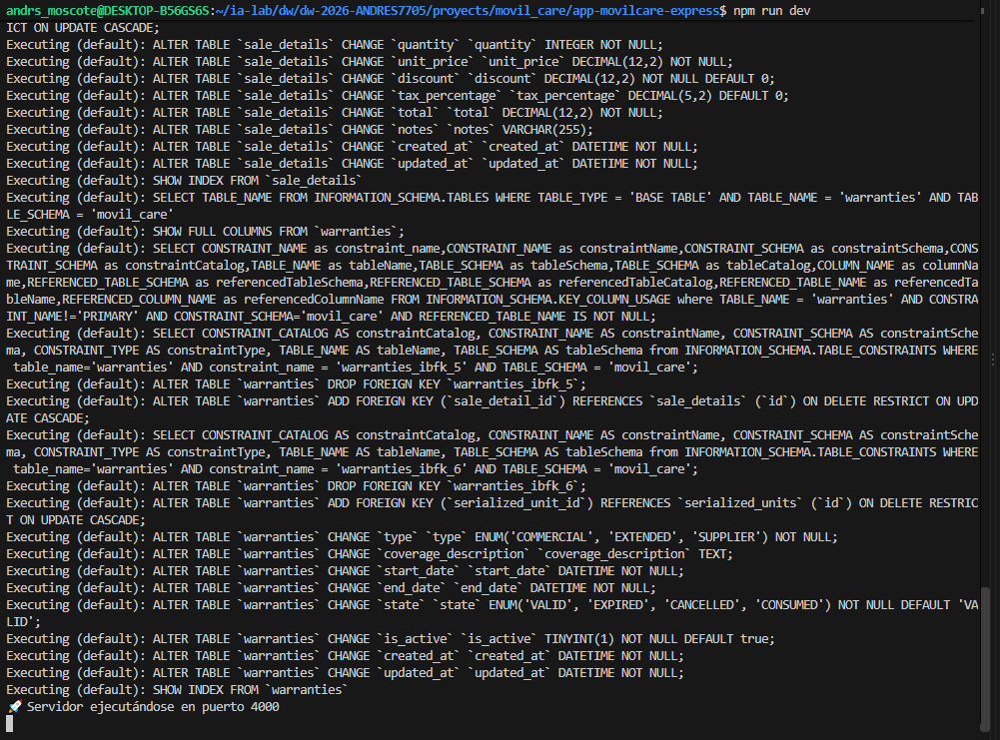

# 8. ISS-03-E — Feature Client — Eliminar (físico y lógico)

**Objetivo:** borrado físico (`DELETE`) y lógico (`status = 'inactive'`).  
**Bloqueado por:** ISS-03-D.

### Criterios de aceptación (ISS-03-E)

- [ ] Controller: `deletePhysical` y `deleteLogical`
- [ ] `DELETE /api/clientes/:id` — físico — **sin auth**
- [ ] `PATCH /api/clientes/:id/deactivate` — lógico → `inactive` — **sin auth**
- [ ] `http/clients.delete.http` con leyenda **SIN AUTH**

### Controller — **PARCHE** `client.controller.ts` (ya existe)

**Debajo de** el comentario `// ================== DELETE ==================`, **añadir** primero el borrado físico y después el lógico:

```ts
  /** Eliminación física */
  public async deletePhysical(req: Request, res: Response) {
    try {
      const id = paramId(req);
      const client = await Client.findByPk(id);
      if (!client) {
        res.status(404).json({ error: "Client not found" });
        return;
      }
      await client.destroy();
      res.status(200).json({ message: "Client permanently deleted", id });
    } catch (error) {
      res.status(500).json({ error: "Error deleting client", detail: String(error) });
    }
  }

  /** Eliminación lógica → status = inactive */
  public async deleteLogical(req: Request, res: Response) {
    try {
      const id = paramId(req);
      const client = await Client.findByPk(id);
      if (!client) {
        res.status(404).json({ error: "Client not found" });
        return;
      }
      await client.update({ status: "inactive" });
      const { password, ...safe } = client.toJSON() as ClientI & { password?: string };
      res.status(200).json({ message: "Client deactivated (logical delete)", client: safe });
    } catch (error) {
      res.status(500).json({ error: "Error deactivating client", detail: String(error) });
    }
  }
```

### Rutas — **PARCHE** `client.routes.ts` (ya existe)

1. **Debajo de** el bloque `// update (PUT / PATCH)`, **añadir** el borrado físico:

```ts
    // delete físico
    app
      .route("/api/clientes/:id")
      .delete(this.clientController.deletePhysical.bind(this.clientController));
```

2. **Debajo de** ese bloque, **añadir** la baja lógica:

```ts
    // delete lógico
    app
      .route("/api/clientes/:id/deactivate")
      .patch(this.clientController.deleteLogical.bind(this.clientController));
```

### HTTP — archivo nuevo

```bash
: > src/features/business/client/http/clients.delete.http
cat >> src/features/business/client/http/clients.delete.http << 'EOF'
### Feature Client — DELETE físico / DELETE lógico (status = inactive)
### Leyenda: SIN AUTH (sin middleware JWT / sin autenticación)
@baseUrl = http://localhost:4000
@id = 1

# @name deleteClientPhysical
DELETE {{baseUrl}}/api/clientes/{{id}}

###

# @name deleteClientLogical
PATCH {{baseUrl}}/api/clientes/{{id}}/deactivate
EOF
```

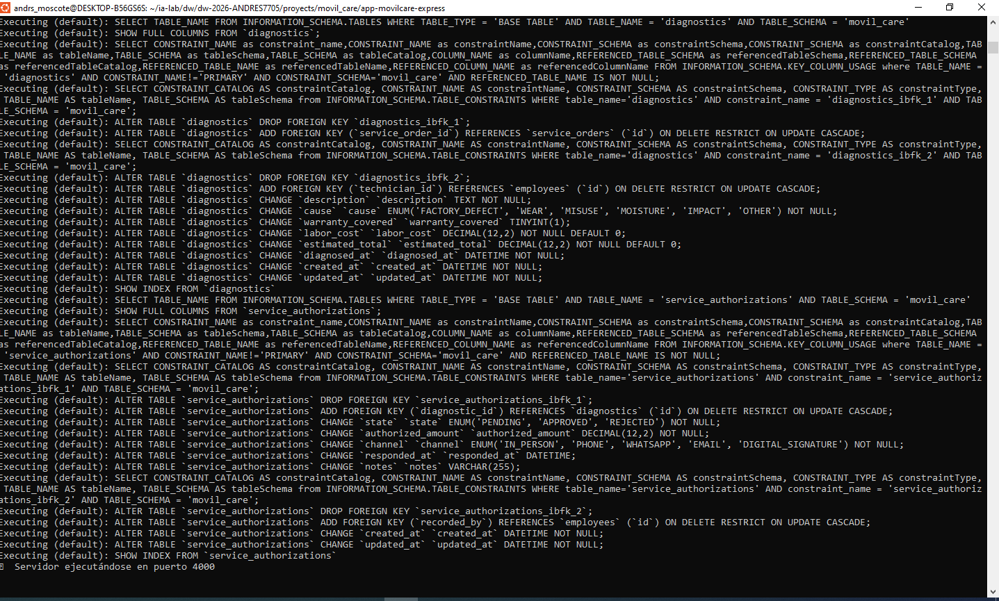


# 9. ISS-04 — Seeders con Faker (feature + runner externo)

**Objetivo:** datos falsos por feature (Faker) y un orquestador externo que ejecuta todos los seeders enviando la **cantidad por entidad**.  
**Bloqueado por:** ISS-03-A (modelo); recomendado tras ISS-03-E.

### Criterios de aceptación (ISS-04) — consolidados

- [ ] **9.1** Existe `features/business/client/client.seeder.ts` con `@faker-js/faker`, recibe `count`, es idempotente
- [ ] **9.2** Existe `database/seeders/index.ts` (SeedersRunner) que llama seeders de features
- [ ] **9.2** Existe `database/seeders/counts.ts` con cantidad por entidad (default / env / CLI)
- [ ] Script `npm run db:seed` funciona
- [ ] Se puede variar cantidad: `npm run db:seed -- --clients=20` o `SEED_CLIENTS=5`

**Diseño**

| Pieza | Ubicación | Rol |
|-------|-----------|-----|
| Seeder del feature | `src/features/business/client/client.seeder.ts` | Genera filas falsas de Client |
| Conteos | `src/database/seeders/counts.ts` | `clients: N` (y futuras entidades) |
| Runner | `src/database/seeders/index.ts` | Importa seeders de features y los ejecuta en orden |

---

## 9.1 Seeder dentro del feature Client

**Criterios**

- [ ] `seedClients(count: number)` exportado desde el feature
- [ ] Usa `@faker-js/faker`
- [ ] Si ya hay filas, no duplica

```bash
npm install -D @faker-js/faker@^10.6.0
```

```bash
: > src/features/business/client/client.seeder.ts
cat >> src/features/business/client/client.seeder.ts << 'EOF'
import { faker } from "@faker-js/faker";
import { Client } from "./client.model";

/**
 * Seeder del feature Client (datos falsos con @faker-js/faker).
 * Se invoca desde `src/database/seeders` (SeedersRunner), no desde la App.
 *
 * Idempotente: si ya hay filas, no vuelve a insertar.
 */
export async function seedClients(count: number): Promise<number> {
  if (count <= 0) {
    console.log("⏭️  clients: count=0, se omite");
    return 0;
  }

  const existing = await Client.count();
  if (existing > 0) {
    console.log(`⏭️  clients: ya hay ${existing} registro(s), se omite seeder`);
    return 0;
  }

  const rows = Array.from({ length: count }, (_, i) => ({
    name: faker.person.fullName(),
    address: faker.location.streetAddress(),
    phone: faker.phone.number({ style: "national" }),
    email: `client.${i}.${faker.string.alphanumeric(6)}@example.com`.toLowerCase(),
    password: "Password123!",
    status: "active" as const,
  }));

  await Client.bulkCreate(rows);
  console.log(`✅ clients: insertados ${count} registro(s) falsos`);
  return count;
}
EOF
```

---

## 9.2 SeedersRunner + conteos por entidad (`database/seeders`)

**Criterios**

- [ ] Runner fuera del feature en `src/database/seeders/`
- [ ] Cantidad configurable por feature (`clients`, …)

### 9.2.1 Conteos

```bash
: > src/database/seeders/counts.ts
cat >> src/database/seeders/counts.ts << 'EOF'
/**
 * Cantidad de registros por feature/entidad.
 * Prioridad: CLI (--clients=N) > env (SEED_CLIENTS) > default de este archivo.
 *
 * Cuando agregues features, suma aquí la clave y léela en el runner.
 */
export type SeedCounts = {
  clients: number;
  // users?: number;
  // roles?: number;
  // products?: number;
};

export const DEFAULT_SEED_COUNTS: SeedCounts = {
  clients: 10,
};

export function resolveSeedCounts(argv: string[] = process.argv.slice(2)): SeedCounts {
  const counts: SeedCounts = { ...DEFAULT_SEED_COUNTS };

  const envClients = process.env.SEED_CLIENTS;
  if (envClients !== undefined && envClients !== "") {
    counts.clients = Number(envClients);
  }

  for (const arg of argv) {
    const m = arg.match(/^--([a-zA-Z_]+)=(\d+)$/);
    if (!m) continue;
    const key = m[1] as keyof SeedCounts;
    const value = Number(m[2]);
    if (key in counts) {
      counts[key] = value;
    }
  }

  return counts;
}
EOF
```

### 9.2.2 Runner

```bash
: > src/database/seeders/index.ts
cat >> src/database/seeders/index.ts << 'EOF'
import dotenv from "dotenv";
import { sequelize, testConnection } from "../db";
import "../../features/business/client/client.model";
import { seedClients } from "../../features/business/client/client.seeder";
import { resolveSeedCounts } from "./counts";

dotenv.config();

/**
 * SeedersRunner — ejecuta TODOS los seeders de features.
 *
 * Ubicación: `src/database/seeders/` (orquestación fuera de cada feature).
 * Cada feature exporta su seeder (ej. `features/business/client/client.seeder.ts`).
 *
 * Uso:
 *   npm run db:seed
 *   npm run db:seed -- --clients=20
 *   SEED_CLIENTS=5 npm run db:seed
 */
export async function runAllSeeders(): Promise<void> {
  const counts = resolveSeedCounts();
  console.log("🌱 Iniciando SeedersRunner...");
  console.log("📊 Conteos:", counts);

  const ok = await testConnection();
  if (!ok) {
    throw new Error("No hay conexión a la base de datos");
  }

  await sequelize.sync({ force: false, alter: true });

  // Orden: business (padres → hijos)
  await seedClients(counts.clients);

  console.log("🌱 SeedersRunner finalizado");
}

if (require.main === module) {
  runAllSeeders()
    .then(async () => {
      await sequelize.close();
      process.exit(0);
    })
    .catch(async (err) => {
      console.error("❌ Error en seeders:", err);
      await sequelize.close();
      process.exit(1);
    });
}
EOF
```

**PARCHE** — `package.json` **ya existe**.

**Dentro de** `"scripts"`, **debajo de** `"dev": "..."`, **añadir** la coma al final de `dev` (si falta) y la clave:

```json
    "db:seed": "ts-node -- src/database/seeders/index.ts"
```

Fragmento esperado:

```json
  "scripts": {
    "build": "tsc",
    "dev": "nodemon --watch src --ext ts --exec ts-node -- src/server.ts",
    "db:seed": "ts-node -- src/database/seeders/index.ts"
  }
```
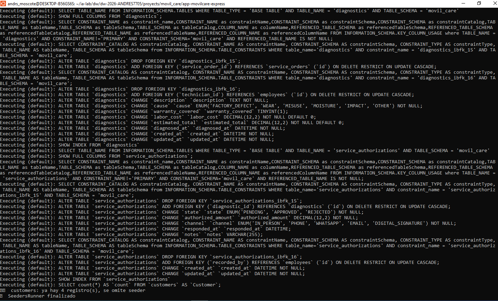


## 10.1 OpenAPI dentro del feature Client

**Criterios**

- [ ] Exporta `clientSwagger` con `tags`, `paths`, `components.schemas`
- [ ] Endpoints documentados como **SIN AUTH**

```bash
# Paquetes (una vez)
npm install swagger-ui-express@^5.0.1
npm install -D @types/swagger-ui-express@^4.1.8
```

Archivo **nuevo**:

```bash
: > src/features/business/client/client.swagger.ts
cat >> src/features/business/client/client.swagger.ts << 'EOF'
/**
 * Documentación OpenAPI del feature Client.
 * Se agrega desde `src/swagger` (registry externo), no se monta aquí.
 *
 * Leyenda: endpoints documentados como SIN AUTH (sin middleware JWT).
 */

export const clientSwagger = {
  tags: [
    {
      name: "Clientes",
      description: "CRUD de clientes — **SIN AUTH** (sin middleware JWT)",
    },
  ],
  paths: {
    "/api/clientes": {
      get: {
        tags: ["Clientes"],
        summary: "Listar clientes activos",
        description: "SIN AUTH — retorna clientes con status=active (sin password)",
        security: [],
        responses: {
          "200": {
            description: "Lista de clientes",
            content: {
              "application/json": {
                schema: {
                  type: "object",
                  properties: {
                    clients: {
                      type: "array",
                      items: { $ref: "#/components/schemas/Client" },
                    },
                  },
                },
              },
            },
          },
        },
      },
      post: {
        tags: ["Clientes"],
        summary: "Crear cliente",
        description: "SIN AUTH",
        security: [],
        requestBody: {
          required: true,
          content: {
            "application/json": {
              schema: { $ref: "#/components/schemas/ClientCreate" },
            },
          },
        },
        responses: {
          "201": {
            description: "Cliente creado",
            content: {
              "application/json": {
                schema: {
                  type: "object",
                  properties: {
                    client: { $ref: "#/components/schemas/Client" },
                  },
                },
              },
            },
          },
        },
      },
    },
    "/api/clientes/{id}": {
      get: {
        tags: ["Clientes"],
        summary: "Obtener cliente por id",
        description: "SIN AUTH",
        security: [],
        parameters: [
          {
            name: "id",
            in: "path",
            required: true,
            schema: { type: "integer" },
          },
        ],
        responses: {
          "200": {
            description: "Cliente encontrado",
            content: {
              "application/json": {
                schema: {
                  type: "object",
                  properties: {
                    client: { $ref: "#/components/schemas/Client" },
                  },
                },
              },
            },
          },
          "404": { description: "No encontrado" },
        },
      },
      put: {
        tags: ["Clientes"],
        summary: "Actualizar cliente (PUT — reemplazo)",
        description: "SIN AUTH",
        security: [],
        parameters: [
          {
            name: "id",
            in: "path",
            required: true,
            schema: { type: "integer" },
          },
        ],
        requestBody: {
          required: true,
          content: {
            "application/json": {
              schema: { $ref: "#/components/schemas/ClientUpdate" },
            },
          },
        },
        responses: {
          "200": { description: "Actualizado" },
          "404": { description: "No encontrado" },
        },
      },
      patch: {
        tags: ["Clientes"],
        summary: "Actualizar cliente (PATCH — parcial)",
        description: "SIN AUTH",
        security: [],
        parameters: [
          {
            name: "id",
            in: "path",
            required: true,
            schema: { type: "integer" },
          },
        ],
        requestBody: {
          required: true,
          content: {
            "application/json": {
              schema: { $ref: "#/components/schemas/ClientPatch" },
            },
          },
        },
        responses: {
          "200": { description: "Actualizado" },
          "404": { description: "No encontrado" },
        },
      },
      delete: {
        tags: ["Clientes"],
        summary: "Eliminar cliente (físico)",
        description: "SIN AUTH — borra la fila",
        security: [],
        parameters: [
          {
            name: "id",
            in: "path",
            required: true,
            schema: { type: "integer" },
          },
        ],
        responses: {
          "200": { description: "Eliminado" },
          "404": { description: "No encontrado" },
        },
      },
    },
    "/api/clientes/{id}/deactivate": {
      patch: {
        tags: ["Clientes"],
        summary: "Eliminar cliente (lógico)",
        description: "SIN AUTH — status = inactive",
        security: [],
        parameters: [
          {
            name: "id",
            in: "path",
            required: true,
            schema: { type: "integer" },
          },
        ],
        responses: {
          "200": { description: "Desactivado" },
          "404": { description: "No encontrado" },
        },
      },
    },
  },
  components: {
    schemas: {
      Client: {
        type: "object",
        properties: {
          id: { type: "integer", example: 1 },
          name: { type: "string", example: "Ana Pérez" },
          address: { type: "string", example: "Calle 10 #20-30" },
          phone: { type: "string", example: "3001234567" },
          email: { type: "string", format: "email", example: "ana@example.com" },
          status: { type: "string", enum: ["active", "inactive"], example: "active" },
          createdAt: { type: "string", format: "date-time" },
          updatedAt: { type: "string", format: "date-time" },
        },
      },
      ClientCreate: {
        type: "object",
        required: ["name", "phone", "email", "password"],
        properties: {
          name: { type: "string" },
          address: { type: "string" },
          phone: { type: "string" },
          email: { type: "string", format: "email" },
          password: { type: "string", format: "password" },
          status: { type: "string", enum: ["active", "inactive"], default: "active" },
        },
      },
      ClientUpdate: {
        type: "object",
        required: ["name", "phone", "email"],
        properties: {
          name: { type: "string" },
          address: { type: "string" },
          phone: { type: "string" },
          email: { type: "string", format: "email" },
          password: { type: "string", format: "password" },
          status: { type: "string", enum: ["active", "inactive"] },
        },
      },
      ClientPatch: {
        type: "object",
        properties: {
          name: { type: "string" },
          address: { type: "string" },
          phone: { type: "string" },
          email: { type: "string", format: "email" },
          password: { type: "string", format: "password" },
          status: { type: "string", enum: ["active", "inactive"] },
        },
      },
    },
  },
};
EOF
```

---

## 10.2 Registry externo + montaje en Config

**Criterios**

- [ ] `buildOpenApiDocument()` fusiona módulos de features
- [ ] `setupSwagger(app)` monta `/api/docs` y `/api/docs.json`
- [ ] `config` invoca `setupSwagger` (método `docs()`)

```bash
mkdir -p src/swagger
```

Archivo **nuevo**:

```bash
: > src/swagger/index.ts
cat >> src/swagger/index.ts << 'EOF'
import { Application } from "express";
import swaggerUi from "swagger-ui-express";
import { clientSwagger } from "../features/business/client/client.swagger";

export type FeatureSwaggerModule = {
  tags: unknown[];
  paths: Record<string, unknown>;
  components?: { schemas?: Record<string, unknown> };
};

/**
 * Registry externo: importa la documentación OpenAPI de cada feature
 * (mismo patrón que SeedersRunner).
 */
const featureSwaggerModules: FeatureSwaggerModule[] = [
  clientSwagger,
  // productSwagger,
  // userSwagger,
];

export function buildOpenApiDocument() {
  const tags: unknown[] = [];
  const paths: Record<string, unknown> = {};
  const schemas: Record<string, unknown> = {};

  for (const mod of featureSwaggerModules) {
    tags.push(...mod.tags);
    Object.assign(paths, mod.paths);
    if (mod.components?.schemas) {
      Object.assign(schemas, mod.components.schemas);
    }
  }

  return {
    openapi: "3.0.3",
    info: {
      title: "StoreLab API",
      version: "1.0.0",
      description:
        "API StoreLab (Express + Sequelize). Los endpoints de Client están documentados como **SIN AUTH** Todas las rutas business son **SIN AUTH** en este lab.",
    },
    servers: [
      {
        url: `http://localhost:${process.env.PORT || 4000}`,
        description: "Local",
      },
    ],
    tags,
    paths,
    components: { schemas },
  };
}

/** Monta Swagger UI y el JSON OpenAPI */
export function setupSwagger(app: Application): void {
  const document = buildOpenApiDocument();
  app.use("/api/docs", swaggerUi.serve, swaggerUi.setup(document));
  app.get("/api/docs.json", (_req, res) => {
    res.json(document);
  });
  console.log("📘 Swagger UI: /api/docs  |  OpenAPI JSON: /api/docs.json");
}
EOF
```

**PARCHE** — `src/config/index.ts` **ya existe**.

1. **Debajo de** `import { Routes } from "../routes/index";` (o **debajo de** los imports de BD/modelo), **añadir**:

```ts
import { setupSwagger } from "../swagger/index";
```

2. **Dentro del** `constructor`, **debajo de** `this.routes();` y **encima de** `this.dbConnection();`, **añadir**:

```ts
    this.docs();
```

3. **Dentro de** la clase `App`, **debajo de** el método `routes()` y **encima de** `dbConnection()`, **añadir**:

```ts
  private docs(): void {
    setupSwagger(this.app);
  }
```

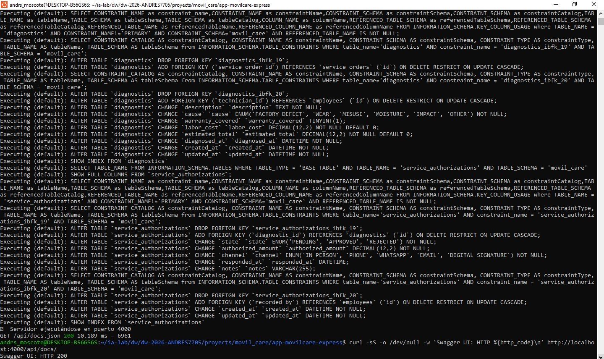

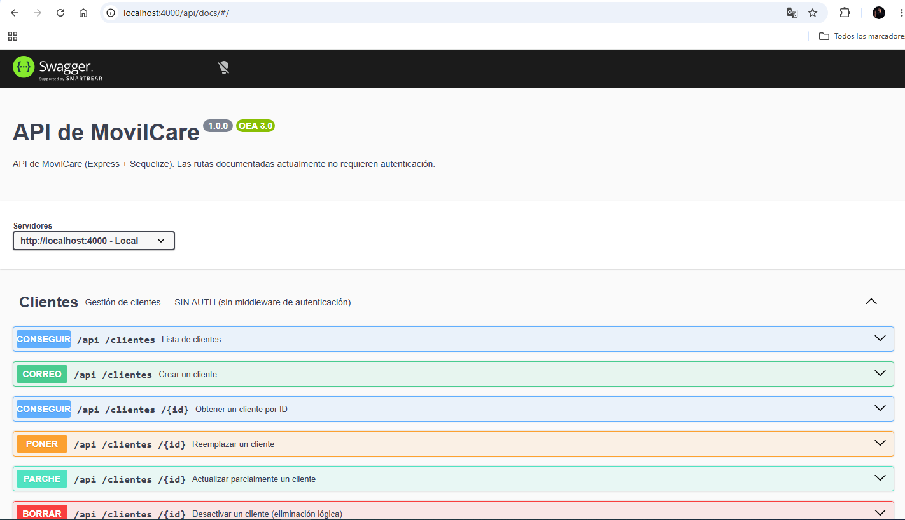


# 11. ISS-06 — Feature ProductType (tipos de producto)

**Objetivo:** CRUD + seeder + swagger de ProductType (sin FK).  
**Bloqueado por:** ISS-05.  
**API:** `/api/tipos-producto` — **SIN AUTH**.  
**Patrón:** mismo que Client (ISS-03-A…E + 04 + 05).

### Criterios de aceptación (ISS-06)

- [ ] **11.1** Modelo `product-type.model.ts` (`status` + `timestamps: true`)
- [ ] **11.2** Controller + routes en este orden: getAll, getOne, create, update PUT/PATCH, delete físico y lógico
- [ ] **11.3** Carpeta `http/` en el mismo orden: get, create, update, delete
- [ ] **11.4** Cableado en `routes/index.ts` + `config` (import model + route)
- [ ] **11.5** Seeder + registro en SeedersRunner / counts
- [ ] **11.6** Swagger + registro en `src/swagger`

```bash
mkdir -p src/features/business/product-type/http
```

---

## 11.1 Modelo ProductType

```bash
: > src/features/business/product-type/product-type.model.ts
cat >> src/features/business/product-type/product-type.model.ts << 'EOF'
import { DataTypes, Model } from "sequelize";
import { sequelize } from "../../../database/db";

export interface ProductTypeI {
  id?: number;
  name: string;
  description?: string | null;
  status: "active" | "inactive";
  createdAt?: Date;
  updatedAt?: Date;
}

export class ProductType extends Model {
  public id!: number;
  public name!: string;
  public description!: string | null;
  public status!: "active" | "inactive";
  public readonly createdAt!: Date;
  public readonly updatedAt!: Date;
}

ProductType.init(
  {
    name: {
      type: DataTypes.STRING,
      allowNull: false,
    },
    description: {
      type: DataTypes.STRING,
      allowNull: true,
    },
    status: {
      type: DataTypes.ENUM("active", "inactive"),
      defaultValue: "inactive",
      allowNull: false,
    },
  },
  {
    sequelize,
    modelName: "ProductType",
    tableName: "product_types",
    timestamps: true,
  }
);
EOF
```
---

## 11.2 Controller + routes (CRUD completo)

```bash
: > src/features/business/product-type/product-type.controller.ts
cat >> src/features/business/product-type/product-type.controller.ts << 'EOF'
import { Request, Response } from "express";
import { ProductType, ProductTypeI } from "./product-type.model";

function paramId(req: Request): number {
  const raw = req.params.id;
  const value = Array.isArray(raw) ? raw[0] : raw;
  return Number(value);
}

export class ProductTypeController {
  // ================== READ ==================
  public async getAll(req: Request, res: Response) {
    try {
      const product_types = await ProductType.findAll({
        where: { status: "active" },
      });
      res.status(200).json({ product_types });
    } catch (error) {
      res.status(500).json({ error: "Error fetching product types", detail: String(error) });
    }
  }

  public async getOne(req: Request, res: Response) {
    try {
      const id = paramId(req);
      const product_type = await ProductType.findByPk(id);
      if (!product_type) {
        res.status(404).json({ error: "Product type not found" });
        return;
      }
      res.status(200).json({ product_type });
    } catch (error) {
      res.status(500).json({ error: "Error fetching product type", detail: String(error) });
    }
  }

  // ================== CREATE ==================
  public async create(req: Request, res: Response) {
    try {
      const body = req.body as ProductTypeI;
      const product_type = await ProductType.create({
        name: body.name,
        description: body.description ?? null,
        status: body.status ?? "active",
      });
      res.status(201).json({ product_type });
    } catch (error) {
      res.status(500).json({ error: "Error creating product type", detail: String(error) });
    }
  }

  // ================== UPDATE ==================
  public async updatePut(req: Request, res: Response) {
    try {
      const id = paramId(req);
      const body = req.body as ProductTypeI;
      const product_type = await ProductType.findByPk(id);
      if (!product_type) {
        res.status(404).json({ error: "Product type not found" });
        return;
      }

      await product_type.update({
        name: body.name,
        description: body.description ?? null,
        status: body.status ?? product_type.status,
      });

      res.status(200).json({ product_type });
    } catch (error) {
      res.status(500).json({ error: "Error updating product type (PUT)", detail: String(error) });
    }
  }

  public async updatePatch(req: Request, res: Response) {
    try {
      const id = paramId(req);
      const body = req.body as Partial<ProductTypeI>;
      const product_type = await ProductType.findByPk(id);
      if (!product_type) {
        res.status(404).json({ error: "Product type not found" });
        return;
      }

      await product_type.update(body);
      res.status(200).json({ product_type });
    } catch (error) {
      res.status(500).json({ error: "Error updating product type (PATCH)", detail: String(error) });
    }
  }

  // ================== DELETE ==================
  /** Eliminación física */
  public async deletePhysical(req: Request, res: Response) {
    try {
      const id = paramId(req);
      const product_type = await ProductType.findByPk(id);
      if (!product_type) {
        res.status(404).json({ error: "Product type not found" });
        return;
      }
      await product_type.destroy();
      res.status(200).json({ message: "Product type permanently deleted", id });
    } catch (error) {
      res.status(500).json({ error: "Error deleting product type", detail: String(error) });
    }
  }

  /** Eliminación lógica → status = inactive */
  public async deleteLogical(req: Request, res: Response) {
    try {
      const id = paramId(req);
      const product_type = await ProductType.findByPk(id);
      if (!product_type) {
        res.status(404).json({ error: "Product type not found" });
        return;
      }
      await product_type.update({ status: "inactive" });
      res.status(200).json({
        message: "Product type deactivated (logical delete)",
        product_type,
      });
    } catch (error) {
      res.status(500).json({ error: "Error deactivating product type", detail: String(error) });
    }
  }
}
EOF
```
```bash
: > src/features/business/product-type/product-type.routes.ts
cat >> src/features/business/product-type/product-type.routes.ts << 'EOF'
import { Application } from "express";
import { ProductTypeController } from "./product-type.controller";

export class ProductTypeRoutes {
  public productTypeController: ProductTypeController = new ProductTypeController();

  public routes(app: Application): void {
    // ================== RUTAS SIN AUTENTICACIÓN / SIN MIDDLEWARE JWT ==================

    // getAll
    app
      .route("/api/tipos-producto")
      .get(this.productTypeController.getAll.bind(this.productTypeController));

    // getOne
    app
      .route("/api/tipos-producto/:id")
      .get(this.productTypeController.getOne.bind(this.productTypeController));

    // create
    app
      .route("/api/tipos-producto")
      .post(this.productTypeController.create.bind(this.productTypeController));

    // update (PUT / PATCH)
    app
      .route("/api/tipos-producto/:id")
      .put(this.productTypeController.updatePut.bind(this.productTypeController))
      .patch(this.productTypeController.updatePatch.bind(this.productTypeController));

    // delete físico
    app
      .route("/api/tipos-producto/:id")
      .delete(this.productTypeController.deletePhysical.bind(this.productTypeController));

    // delete lógico
    app
      .route("/api/tipos-producto/:id/deactivate")
      .patch(this.productTypeController.deleteLogical.bind(this.productTypeController));
  }
}
EOF
```
---

## 11.3 HTTP (REST Client)

```bash
: > src/features/business/product-type/http/product-types.get.http
cat >> src/features/business/product-type/http/product-types.get.http << 'EOF'
### Feature ProductType — GET ALL / GET ONE
### Leyenda: SIN AUTH (sin middleware JWT / sin autenticación)
@baseUrl = http://localhost:4000
@id = 1

# @name getAllProductTypes
GET {{baseUrl}}/api/tipos-producto

###

# @name getOneProductType
GET {{baseUrl}}/api/tipos-producto/{{id}}
EOF
```

```bash
: > src/features/business/product-type/http/product-types.create.http
cat >> src/features/business/product-type/http/product-types.create.http << 'EOF'
### Feature ProductType — CREATE
### Leyenda: SIN AUTH (sin middleware JWT / sin autenticación)
@baseUrl = http://localhost:4000

# @name createProductType
POST {{baseUrl}}/api/tipos-producto
Content-Type: application/json

{
  "name": "Electrónica",
  "description": "Dispositivos y accesorios",
  "status": "active"
}
EOF
```
```bash
: > src/features/business/product-type/http/product-types.update.http
cat >> src/features/business/product-type/http/product-types.update.http << 'EOF'
### Feature ProductType — UPDATE (PUT) / UPDATE (PATCH)
### Leyenda: SIN AUTH (sin middleware JWT / sin autenticación)
@baseUrl = http://localhost:4000
@id = 1

# @name updateProductTypePut
PUT {{baseUrl}}/api/tipos-producto/{{id}}
Content-Type: application/json

{
  "name": "Electrónica Actualizada",
  "description": "Categoría renovada",
  "status": "active"
}

###

# @name updateProductTypePatch
PATCH {{baseUrl}}/api/tipos-producto/{{id}}
Content-Type: application/json

{
  "description": "Descripción parcial"
}
EOF
```
```bash
: > src/features/business/product-type/http/product-types.delete.http
cat >> src/features/business/product-type/http/product-types.delete.http << 'EOF'
### Feature ProductType — DELETE físico / DELETE lógico (status = inactive)
### Leyenda: SIN AUTH (sin middleware JWT / sin autenticación)
@baseUrl = http://localhost:4000
@id = 1

# @name deleteProductTypePhysical
DELETE {{baseUrl}}/api/tipos-producto/{{id}}

###

# @name deleteProductTypeLogical
PATCH {{baseUrl}}/api/tipos-producto/{{id}}/deactivate
EOF
```
---

## 11.4 Cableado Routes + Config

**PARCHE** — `src/routes/index.ts` **ya existe**.

1. **Debajo de** `import { ClientRoutes } ...`, **añadir**:

```ts
import { ProductTypeRoutes } from "../features/business/product-type/product-type.routes";
```

2. **Dentro de** `export class Routes`, **debajo de** `clientRoutes`, **añadir**:

```ts
  public productTypeRoutes: ProductTypeRoutes = new ProductTypeRoutes();
```

**PARCHE** — `src/config/index.ts` **ya existe**.

1. **Debajo de** `import "../features/business/client/client.model";`, **añadir**:

```ts
import "../features/business/product-type/product-type.model";
```

2. **Dentro de** `routes()`, **debajo de** `this.routePrv.clientRoutes.routes(this.app);`, **añadir**:

```ts
    this.routePrv.productTypeRoutes.routes(this.app);
```

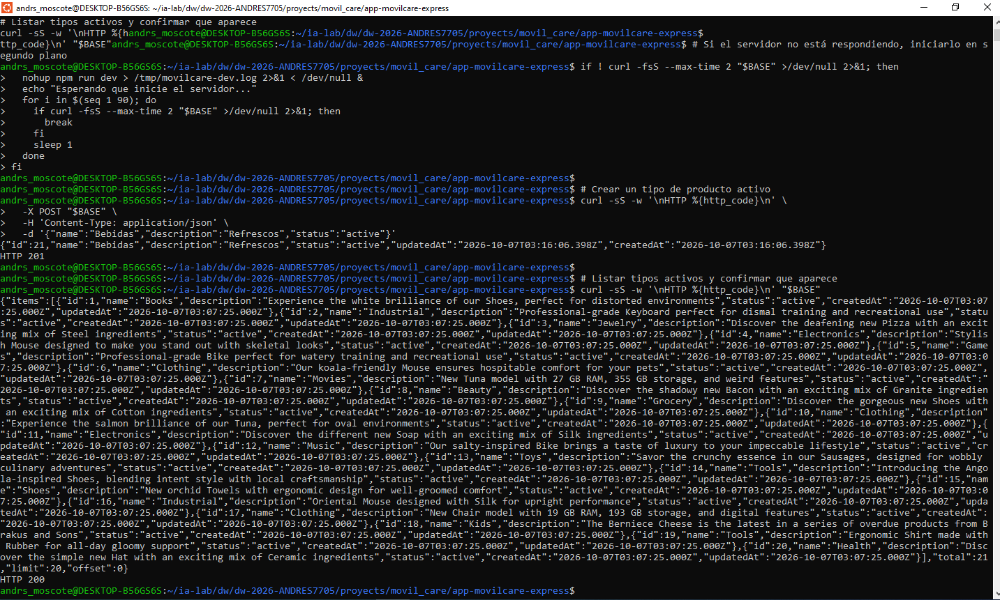 
